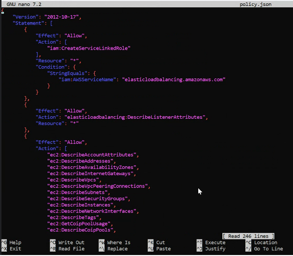

# Deploying a Three-tier-application on EKS

This is a tideous process, please do this patiently!

Kanu Didi, calm down! Relax hoja pehle, fir aaram se krle.. 😁

## Install the Prerequiste

kubectl – A command line tool for working with Kubernetes clusters. For more information, see Installing or updating kubectl. https://docs.aws.amazon.com/eks/latest/userguide/install-kubectl.html

eksctl – A command line tool for working with EKS clusters that automates many individual tasks. For more information, see Installing or updating. https://docs.aws.amazon.com/eks/latest/userguide/eksctl.html

AWS CLI – A command line tool for working with AWS services, including Amazon EKS. For more information, see Installing, updating, and uninstalling the AWS CLI https://docs.aws.amazon.com/cli/latest/userguide/cli-chap-install.html in the AWS Command Line Interface User Guide.

After installing the AWS CLI, I recommend that you also configure it. For more information, see Quick configuration with aws configure in the AWS Command Line Interface User Guide. https://docs.aws.amazon.com/cli/latest/userguide/cli-configure-quickstart.html#cli-configure-quickstart-config

## Create EKS Cluster

Create a EKS Cluster

```bash
eksctl create cluster --name demo-cluster-three-tier-1 --region us-east-1
```

## IAM OIDC provider

Export the cluster name

```bash
export cluster_name=demo-cluster-three-tier-1
```

Configure IAM OIDC provider

```bash
oidc_id=$(aws eks describe-cluster --name $cluster_name --query "cluster.identity.oidc.issuer" --output text | cut -d '/' -f 5)
```

Check if there is an IAM OIDC provider configured already

```bash
aws iam list-open-id-connect-providers | grep $oidc_id | cut -d "/" -f4
```

If not, run the below command

```bash
eksctl utils associate-iam-oidc-provider --cluster $cluster_name --approve
```

## setting up ALB add-on

Download IAM policy

```bash
curl -O https://raw.githubusercontent.com/kubernetes-sigs/aws-load-balancer-controller/v2.5.4/docs/install/iam_policy.json
```

Create IAM Policy

```bash
aws iam create-policy \
    --policy-name AWSLoadBalancerControllerIAMPolicy \
    --policy-document file://iam_policy.json
```

Create an IAM Role

```bash
eksctl create iamserviceaccount \
  --cluster=demo-cluster-three-tier-1 \
  --namespace=kube-system \
  --name=aws-load-balancer-controller \
  --role-name AmazonEKSLoadBalancerControllerRole \
  --attach-policy-arn=arn:aws:iam::211125759649:policy/AWSLoadBalancerControllerIAMPolicy \
  --approve
```

## Deploy ALB Controller

Add HELM repo

```
helm repo add eks https://aws.github.io/eks-charts
```

Update the repo

```
helm repo update eks
```

Install ALB Controller from EKS HELM Chart

```bash
helm install aws-load-balancer-controller eks/aws-load-balancer-controller \
  -n kube-system \
  --set clusterName=<your-cluster-name> \
  --set serviceAccount.create=false \
  --set serviceAccount.name=aws-load-balancer-controller \
  --set region=<region> \
  --set vpcId=<your-vpc-id>
```

If the above command doesn't work use the below command

```bash
helm install aws-load-balancer-controller eks/aws-load-balancer-controller -n kube-system --set clusterName=demo-cluster-three-tier-1 --set serviceAccount.create=false --set serviceAccount.name=aws-load-balancer-controller --set region=<region> --set vpcId=<vpc-id>
```

Verify that the deployments are running.

```bash
kubectl get deployment -n kube-system aws-load-balancer-controller
```

### Edit the IAM Policy created earlier

Get the existing policy

```bash
aws iam get-policy-version --policy-arn arn:aws:iam::<your-aws-account-id>:policy/AWSLoadBalancerControllerIAMPolicy --version-id $(aws iam get-policy --policy-arn arn:aws:iam::<your-aws-account-id>:policy/AWSLoadBalancerControllerIAMPolicy --query 'Policy.DefaultVersionId' --output text)
```

In the output search for the policy `elasticloadbalancing:DescribeListenerAttributes`.

If it does noyt exist, download the existing policy into file named **policy.json**

```bash
aws iam get-policy-version \
    --policy-arn arn:aws:iam::<your-aws-account-id>:policy/AWSLoadBalancerControllerIAMPolicy \
    --version-id $(aws iam get-policy --policy-arn arn:aws:iam::<your-aws-account-id>:policy/AWSLoadBalancerControllerIAMPolicy --query 'Policy.DefaultVersionId' --output text) \
    --query 'PolicyVersion.Document' --output json > policy.json
```

Edit policy.json to add the missing permissions

```bash
{
  "Effect": "Allow",
  "Action": "elasticloadbalancing:DescribeListenerAttributes",
  "Resource": "*"
}
```

**Reference**


Create a new policy version using the updated **policy.json** file

```bash
aws iam create-policy-version --policy-arn arn:aws:iam::<your-aws-account-id>:policy/AWSLoadBalancerControllerIAMPolicy --policy-document file://policy.json --set-as-default
```

## EBS CSI Plugin configuration

The Amazon EBS CSI plugin requires IAM permissions to make calls to AWS APIs on your behalf.

```bash
eksctl create iamserviceaccount \
    --name ebs-csi-controller-sa \
    --namespace kube-system \
    --cluster <YOUR-CLUSTER-NAME> \
    --role-name AmazonEKS_EBS_CSI_DriverRole \
    --role-only \
    --attach-policy-arn arn:aws:iam::aws:policy/service-role/AmazonEBSCSIDriverPolicy \
    --approve
```

Run the following command. Replace with the name of your cluster, with your account ID.

```bash
eksctl create addon --name aws-ebs-csi-driver --cluster <YOUR-CLUSTER-NAME> --service-account-role-arn arn:aws:iam::<AWS-ACCOUNT-ID>:role/AmazonEKS_EBS_CSI_DriverRole --force
```

## Get the Source Code for the Application\

Clone the repo

```bash
git clone https://github.com/iam-veeramalla/three-tier-architecture-demo.git
```

Create a Kuberenetes Namespace

```bash
kubectl create ns robot-shop
```

Install the HELM Chart in the K8s Namespace

```bash
helm install robot-shop --namespace robot-shop .
```

List the pods, wait for all the pods to be up and running

```bash
cd three-tier-architecture-demo/EKS/helm/

kubectl get po -n robot-shop
```

Get the services, validate the services are properly reflected

```bash
kubectl get svc -n robot-shop
```

Apply the Ingress

```bash
kubectl apply -f ingress.yaml
```
